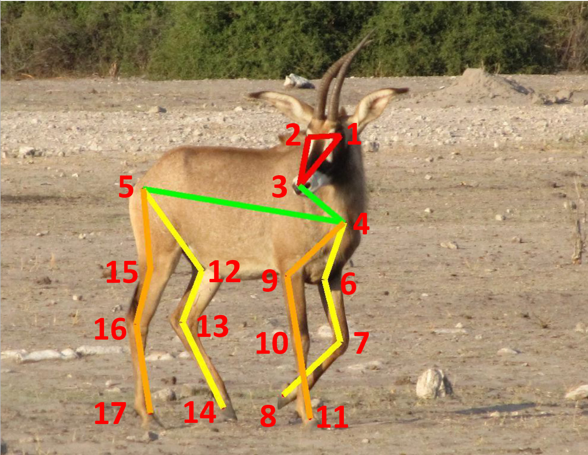
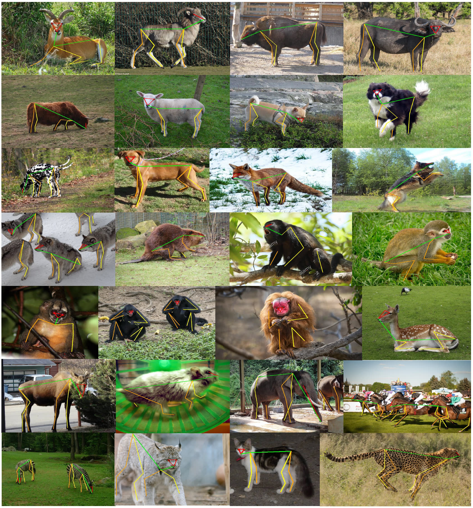

<h1 align="left">AP-10K: A Benchmark for Animal Pose Estimation in the Wild <a href="https://arxiv.org/abs/2108.12617">.svg" ></a>
</a> </h1> 

<p align="center">
  <a href="#introduction">Introduction</a> |
  <a href="#Updates">Updates</a> |
  <a href="#Overview">Overview</a> |
  <a href="#download">Download</a> |
  <a href="#training-code">Training Code</a>
</p>

## Introduction

<p align="left">This repository is the official reporisity of <a href='https://openreview.net/forum?id=rH8yliN6C83'>AP-10K: A Benchmark for Animal Pose Estimation in the Wild</a> (NeurIPS 2021 Datasets and Benchmarks Track). It contains the introduction, annotation files, and code for the dataset AP-10K, which is the first large-scale dataset for general animal pose estimation. AP-10K consists of 10,015 images collected and filtered from 23 animal families and 54 species, with high-quality keypoint annotations. We also contain another about 50k images with family and species labels. The dataset can be used for supervised learning, cross-domain transfer learning, and intra- and inter-family domain. It can also be used in self-supervised learning, semi-supervised learning, etc. The annotation files are provided following the COCO style. </p>

## Updates

***01/11/2021***
We have uploaded the corresponding code and pretrained models for the usage of AP-10K dataset!

***01/11/2021***
We have updated the dataset! It now has 54 species for training!

***01/11/2021***
The AP-10K dataset is integrated into <a href='https://github.com/open-mmlab/mmpose/blob/master/docs/tasks/2d_animal_keypoint.md#ap-10k'>mmpose</a>! Please enjoy it!

***11/10/2021***
The paper is accepted to <a href='https://openreview.net/forum?id=rH8yliN6C83'>NeurIPS 2021 Datasets and Benchmarks Track</a>!

***31/08/2021***
The paper is post on <a href="https://arxiv.org/abs/2108.12617">arxiv</a>! We have uploaded the annotation file!

## Overview

### keypoint definition

<p align="center">

</p>

<table div align=center>
<thead>
  <tr>
    <th>Keypoint</th>
    <th>Description</th>
    <th>Keypoint</th>
    <th>Description</th>
  </tr>
</thead>
<tbody>
  <tr>
    <td>1</td>
    <td>Left Eye</td>
    <td>2</td>
    <td>Right Eye</td>
  </tr>
  <tr>
    <td>3</td>
    <td>Nose</td>
    <td>4</td>
    <td>Neck</td>
  </tr>
  <tr>
    <td>5</td>
    <td>Root of Tail</td>
    <td>6</td>
    <td>Left Shoulder</td>
  </tr>
  <tr>
    <td>7</td>
    <td>Left Elbow</td>
    <td>8</td>
    <td>Left Front Paw</td>
  </tr>
  <tr>
    <td>9</td>
    <td>Right Shoulder</td>
    <td>10</td>
    <td>Right Elbow</td>
  </tr>
  <tr>
    <td>11</td>
    <td>Right Front Paw</td>
    <td>12</td>
    <td>Left Hip</td>
  </tr>
  <tr>
    <td>13</td>
    <td>Left Knee</td>
    <td>14</td>
    <td>Left Back Paw</td>
  </tr>
  <tr>
    <td>15</td>
    <td>Right Hip</td>
    <td>16</td>
    <td>Right Knee</td>
  </tr>
  <tr>
    <td>17</td>
    <td>Right Back Paw</td>
    <td></td>
    <td></td>
  </tr>
</tbody>
</table>

### Annotations Overview
<p align="center">

</p>

### Image Background
<table div align=center>
<thead>
  <tr>
    <th>Id</th>
    <th>Background type</th>
    <th>Id</th>
    <th>Background type</th>
  </tr>
</thead>
<tbody>
  <tr>
    <td>1</td>
    <td>grass or savanna</td>
    <td>2</td>
    <td>forest or shrub</td>
  </tr>
  <tr>
    <td>3</td>
    <td>mud or rock</td>
    <td>4</td>
    <td>snowfield</td>
  </tr>
  <tr>
    <td>5</td>
    <td>zoo or human habitation</td>
    <td>6</td>
    <td>swamp or rivderside</td>
  </tr>
  <tr>
    <td>7</td>
    <td>desert or gobi</td>
    <td>8</td>
    <td>mugshot</td>
  </tr>
</tbody>
</table>

## Download

The dataset and corresponding files can be downloaded from 

<a href='https://drive.google.com/file/d/1-FNNGcdtAQRehYYkGY1y4wzFNg4iWNad/view?usp=sharing'>[Google Drive]</a> <a href='https://pan.baidu.com/s/1tBGHjHIjDBV9Wcwy_Y2pkw'>[Baidu Pan]</a> (code: 6uz6)

(Optional) The full version with both labeled and unlabeled images can be downloaded with the script provided here 

<a href='https://drive.google.com/file/d/1HNBy7fzF7EgIzM1JTJFYwpQFaWjwDeXD/view?usp=sharing'>[Google Drive]</a> <a href='https://pan.baidu.com/s/16ev1YnI6ZS3CwpEQ-jtmPg'>[Baidu Pan]</a> (code: 5lxi)


## Training Code

Here we provide the example of training models with the AP-10K dataset. The code is based on the <a href='https://github.com/open-mmlab/mmpose/blob/master/docs/tasks/2d_animal_keypoint.md#ap-10k'>mmpose</a> project. 


### Installation

Please refer to <a href='https://github.com/open-mmlab/mmpose/blob/master/docs/install.md'>install.md</a> for Installation.

### Dataset Preparation

Please download the dataset from the <a href='#download'>Download</a> Section, and please extract the dataset under the data folder, e.g.,

```
mkdir data
unzip ap-10k.zip -d data/
mv data/ap-10k data/ap10k
```

The extracted dataset should be looked like:

```text
AP-10K
├── mmpose
├── docs
├── tests
├── tools
├── configs
|── data
    │── ap10k
        │-- annotations
        │   │-- ap10k-train-split1.json
        │   |-- ap10k-train-split2.json
        │   |-- ap10k-train-split3.json
        │   │-- ap10k-val-split1.json
        │   |-- ap10k-val-split2.json
        │   |-- ap10k-val-split3.json
        │   |-- ap10k-test-split1.json
        │   |-- ap10k-test-split2.json
        │   |-- ap10k-test-split3.json
        │-- data
        │   │-- 000000000001.jpg
        │   │-- 000000000002.jpg
        │   │-- ...

```

### Inference

The checkpoints can be downloaded from [HRNet-w32](https://download.openmmlab.com/mmpose/animal/hrnet/hrnet_w32_ap10k_256x256-18aac840_20211029.pth), [HRNet-w48](https://download.openmmlab.com/mmpose/animal/hrnet/hrnet_w48_ap10k_256x256-d95ab412_20211029.pth), [ResNet-50](https://download.openmmlab.com/mmpose/animal/resnet/res50_ap10k_256x256-35760eb8_20211029.pth), [ResNet-101](https://download.openmmlab.com/mmpose/animal/resnet/res101_ap10k_256x256-9edfafb9_20211029.pth).

```python
python tools/test.py <CONFIG_FILE> <DET_CHECKPOINT_FILE>
```

### Training

```python
bash tools/dist_train.sh <CONFIG_FILE> <GPU_NUM>
```

For example, to train the HRNet-w32 model with 1 GPU, please run:

```python
bash tools/dist_train.sh configs/animal/2d_kpt_sview_rgb_img/topdown_heatmap/ap10k/hrnet_w32_ap10k_256x256.py 1
```

## Key Questions
### 1.For what purpose was the dataset created?
AP-10K is created to facilitate research in the area of animal pose estimation. It is important to study several challenging questions in the context of more training data from diverse species are available, such as：
1) how about the performance of different representative human pose models on the animal pose estimation task? 
2) will the representation ability of a deep model benefit from training on a large-scale dataset with diverse species?
3) how about the impact of pretraining, e.g., on the ImageNet dataset or human pose estimation dataset, in the context of the large-scale of dataset with diverse species?
4) how about the intra and inter family generalization ability of a model trained using data from specific species or family?

However, previous datasets for animal pose estimation contain limited number of animal species. Therefore, it is impossible to study these questions using existing datasets as they contains at most 5 species, which is far from enough to get sound conclusion. By contrast, AP-10K has 23 family and 54 species and thus can help researchers to study these questions.

### 2.Was any cleaning of the data done?
We removed replicated images by using aHash algorithm to detect similar images and manually checking. Images with heavy occlusion and logos were removed manually. The cleaned images were categorized into diifferent species and family.

### 3.How were the keypoints instructed to be labeled?
Annotators first learned about the physiognomy, body structure and distribution of keypoints of the animals. Then, five images of each species were presented to annotators to annotate keypoints, which were used to assess their annotation quality. Annotators with good annotation quality were further trained on how to deal with the partial absence of the body due to occlusion and were involved in the subsequent annotation process. Annotators were asked to annotate all visible keypoints. For the occluded keypoints, they were asked to annotate keypoints whose location they could estimate based on body plan, pose, and the symmetry property of the body, where the length of occluded limbs or the location of occluded keypoints could be inferred from the visible limbs or keypoints. Other keypoints were left unlabeled.

To guarantee the annotation quality, we have adopted a sequential labeling strategy. Three rounds of cross-check and correction are conducted with both manual check and automatic check (according to specific rules, \eg, keypoints belonging to an instance are in the same bounding box) to reduce the possibility of mislabeling. To begin with, annotators labeled keypoints of each instance and submited a version-1 labels to senior well-trained annotators, and then senior well-trained annotators checked the quality of the version-1 labels and returned an error list to annotators, annotators would fix these errors according to it. Finally, annotators submited a fixed version-2 labels to senior well-trained annotator and they did the last correction to find any potential mislabeled keypoints. After all three rounds of work had been done, a release-version of dataset with high-quality labels was finished.

### 4.Unity of keypoint and difference of walk type
If we only follow the biology and define the keypoints by the position of the bones, the actual labeled keypoint maybe hard, even invisible for labeling and which look like inharmonious with animal’s movement. Ungulates (or other unguligrade animals) mainly rely on their toes in movement, with their paws, ankles, and knees observable. Compared with these keypoints, the actual hips are less distinctive and difficult to annotate since they are hidden in their body. A similar phenomenon can also be observed in digitigrade animals. On the other hand, plantigrade animals always walk with metatarsals (paws) flat on the ground, with their paws, knees, and hips more distinguishable in movement. Thus, we denote the paws, ankles, and knees for the unguligrade and digitigrade animals, and the paws, knees, and hips for the plantigrade animals. For simplicity, we use 'hip' to denote the knees for unguligrade and digitigrade animals and 'knee' for their ankles. For plantigrade animals, the annotation is the same as the biology definition. Thus, the visual distribution of keypoints is similar across the dataset, as the 'knee' is around the middle of the limbs for all animals.

### 5.What tasks could the dataset be used for?
AP-10K can be used for the research of animal pose estimation. Besides, it can also be used for specific machine learning topics such as few-shot learning, domain generalization, self-supervised learning. Please see the Discussion part in the paper.
