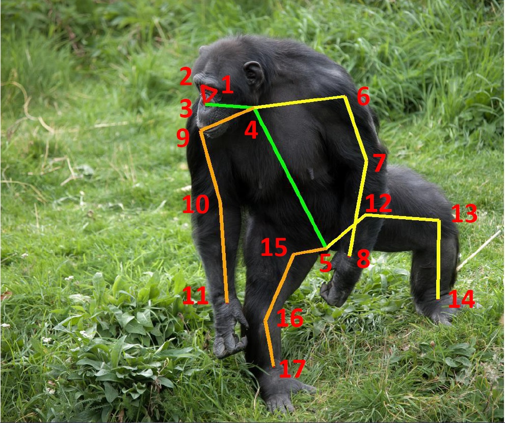
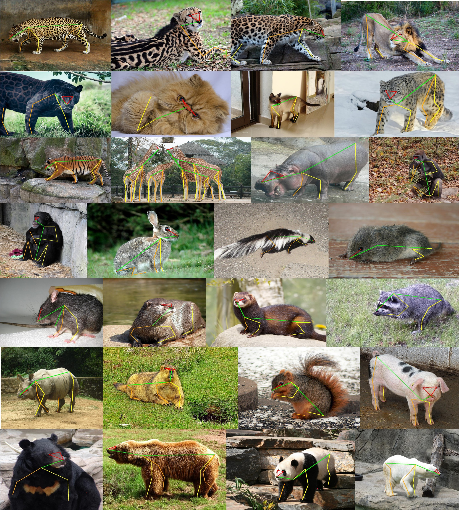

<h1 align="left">AP-10K: A Benchmark for Animal Pose Estimation in the Wild <a href="https://arxiv.org/abs/2108.12617">.svg" ></a>
</a> </h1> 

  <a href="#introduction">Introduction</a> |
  <a href="#Updates">Updates</a> |
  <a href="#Overview">Overview</a>

## Introduction

This repository contains the introduction, annotation files, and code for the dataset AP-10K, which is the first large-scale dataset for general animal pose estimation. AP-10K consists of 10,015 images collected and filtered from 23 animal families and 54 species, with high-quality keypoint annotations. We also contain another about 50k images with family and species labels. The dataset can be used for supervised learning, cross-domain transfer learning, and intra- and inter-family domain. It can also be used in self-supervised learning, semi-supervised learning, etc. The annotation files are provided following the COCO style. 

## Updates

***01/11/2021***
We have updated the dataset! It now has 54 species for training! The dataset can be downloaded from 

<a href='https://drive.google.com/file/d/1-FNNGcdtAQRehYYkGY1y4wzFNg4iWNad/view?usp=sharing'>[Google Drive]</a> <a href='https://pan.baidu.com/s/1tBGHjHIjDBV9Wcwy_Y2pkw'>[Baidu Pan]</a> (code: 6uz6)

***01/11/2021***
The AP-10K dataset is integrated into <a href='https://github.com/open-mmlab/mmpose/blob/master/docs/tasks/2d_animal_keypoint.md#ap-10k'>mmpose</a>! Please enjoy it!

***31/08/2021***
The paper is post on <a href="https://arxiv.org/abs/2108.12617">arxiv</a>! We have uploaded the annotation file!

## Overview

### keypoint definition

<table div align=center>
<thead>
  <tr>
    <th>Keypoint</th>
    <th>Description</th>
    <th>Keypoint</th>
    <th>Description</th>
  </tr>
</thead>
<tbody>
  <tr>
    <td>1</td>
    <td>Left Eye</td>
    <td>2</td>
    <td>Right Eye</td>
  </tr>
  <tr>
    <td>3</td>
    <td>Nose</td>
    <td>4</td>
    <td>Neck</td>
  </tr>
  <tr>
    <td>5</td>
    <td>Root of Tail</td>
    <td>6</td>
    <td>Left Shoulder</td>
  </tr>
  <tr>
    <td>7</td>
    <td>Left Elbow</td>
    <td>8</td>
    <td>Left Front Paw</td>
  </tr>
  <tr>
    <td>9</td>
    <td>Right Shoulder</td>
    <td>10</td>
    <td>Right Elbow</td>
  </tr>
  <tr>
    <td>11</td>
    <td>Right Front Paw</td>
    <td>12</td>
    <td>Left Hip</td>
  </tr>
  <tr>
    <td>13</td>
    <td>Left Knee</td>
    <td>14</td>
    <td>Left Back Paw</td>
  </tr>
  <tr>
    <td>15</td>
    <td>Right Hip</td>
    <td>16</td>
    <td>Right Knee</td>
  </tr>
  <tr>
    <td>17</td>
    <td>Right Back Paw</td>
    <td></td>
    <td></td>
  </tr>
</tbody>
</table>

### Annotations Overview

